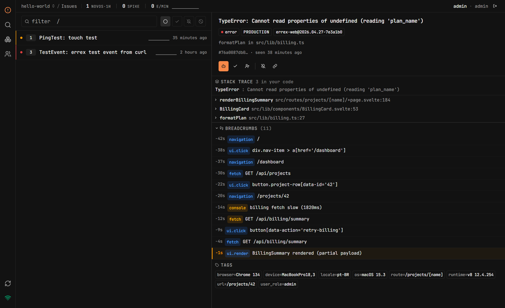

<div align="center">

# errex

**Self-hosted error tracking that runs in 7.5 MB of RAM — daemon + dashboard. Sentry-SDK compatible. One binary.**

[](./LICENSE)
[](#status)
[](https://www.rust-lang.org/)
[](https://github.com/TheHoltz/errex/stargazers)

<br>



</div>

## About

errex is a tiny, **self-hostable error tracker** for people who want their own error inbox without standing up Sentry's Postgres + Redis + Kafka stack. Drop any **Sentry SDK** into your app, point it at errex, and you get grouped exceptions, stack traces, occurrence counts, regression detection, and Slack / Discord / Teams alerts.

The whole thing is **one 6 MB Rust binary** with a fast **SvelteKit dashboard** embedded. Persistence is a single **SQLite** file (no Postgres, no Redis). The ingest pipeline is single-writer with bounded buffers — backpressure, not unbounded queues.

errex is also **MCP-ready**: an AI agent can plug straight into the daemon to triage issues, summarize stack traces, and resolve duplicates without touching the dashboard. (Stub today; the protocol surface is wired.)

If you're an indie dev, a homelabber, or running a small product, this is probably what you wanted Sentry to be — **error monitoring that fits on the same $5 VPS as your app, with room to spare**.

## Numbers (measured, not estimated)

Single CPU, 30-second sustained workload, daemon `taskset -c 0`-pinned. **Idle is post-warmup** — every SPA asset (HTML + JS bundles + favicon) has been served at least once, so the dashboard is "loaded into memory" the way it would be after one operator opens it.

| operating point              | achieved RPS | p99 ingest | RSS mean | RSS max |
|------------------------------|-------------:|-----------:|---------:|--------:|
| **idle** (daemon + SPA warm) |          —   |        —   | **7.5 MB** |  7.5 MB |
| **typical** (100 RPS)        |          100 |     ~3 ms  | **9.9 MB** | ~10 MB |
| **saturation** (8000 target) |         7478 |    2.5 ms  | **10.5 MB** | 11.1 MB |

Stripped binary (daemon + embedded SPA + assets): **6.04 MB**. Zero ingest errors at every operating point. WebSocket fan-out is lossless to 64 subscribers under sustained load. Reproduce any of these with `scripts/stress/multibench.sh`.

### What this means for hosting cost

- The smallest tier on Railway / Fly / Render / etc. is **256 MB**. errex uses **2.9%** of that at idle.
- 100 RPS sustained leaves **96% of a 256 MB tier free** for your other workloads.
- Spike to 8000 events/sec: still sub-12 MB. No tier upgrade needed.
- Frontend is included — there's no second container, no nginx in front of static files, no extra service to provision.
- Compare:

| | min RAM | external deps | services | install |
|---|---:|---|---:|---|
| **errex** | **~7.5 MB** | none | **1** | one binary |
| GlitchTip | ~512 MB | Postgres + Redis | 3 | docker-compose |
| Sentry self-host | ~4 GB | Postgres + Redis + Kafka + Snuba + Clickhouse | ~10 | full stack |

> [!NOTE]
> errex is **alpha**. The hot path (ingest → group → store → broadcast) is wired and tested end-to-end. Source maps and multi-tenant orgs aren't shipped yet — see [Status](#status).

## Install

```bash
git clone https://github.com/TheHoltz/errex
cd errex
docker compose -f docker/docker-compose.yml up -d
```

Open <http://localhost:9090>, finish the first-run setup wizard, and you're in. The full env / CLI reference is in [docs/CONFIGURATION.md](./docs/CONFIGURATION.md).

## Custom domain (one env var)

Set `ERREXD_PUBLIC_URL` to the externally-reachable URL. Everything that needs to know the public host — DSN, webhook payload links, dashboard test-event curl example — picks it up from this single value.

```bash
ERREXD_PUBLIC_URL=https://errex.example.com
```

| platform           | what to do                                                                                                                                  |
|--------------------|---------------------------------------------------------------------------------------------------------------------------------------------|
| **Railway / Fly / Render / Heroku** | Add a custom domain in the platform UI, set `ERREXD_PUBLIC_URL` to that URL, deploy. Port is auto-detected from the platform's `PORT` env. |
| **Caddy reverse proxy** | `errex.example.com { reverse_proxy localhost:9090 }`, set `ERREXD_PUBLIC_URL=https://errex.example.com`. Caddy handles TLS.            |
| **Nginx / Traefik** | Standard upstream to `localhost:9090`, set `ERREXD_PUBLIC_URL` to the public HTTPS URL. Forward `Host` and `Upgrade` headers for the WebSocket. |

errexd serves plain HTTP on its bind port; TLS termination is the proxy/edge's job (every modern PaaS does this for free). The daemon prints a startup warning if `ERREXD_PUBLIC_URL` is left at its `localhost:9090` default while bound to a public interface — DSNs would point at localhost otherwise, and remote SDKs would silently miss the daemon.

## How it works

```
SDK ──envelope──▶ /api/<project>/envelope/ ──▶ digest ──▶ SQLite
                                                  │
                                                  ├──▶ broadcast ──▶ WebSocket ──▶ dashboard
                                                  │
                                                  └──▶ webhook ──▶ Slack / Discord / Teams
```

Single-writer ingest pipeline; readers hit SQLite directly via WAL. No in-memory caches. Bounded channels with intentional backpressure. The dependency footprint is deliberately tiny — see [docs/ARCHITECTURE.md](./docs/ARCHITECTURE.md) for the design rationale.

## Status

| | |
|---|---|
| ✅ | Sentry envelope ingest (gzip + plaintext) |
| ✅ | SQLite persistence with WAL |
| ✅ | Fingerprint-based grouping |
| ✅ | Live WebSocket updates |
| ✅ | Resolve / mute / ignore / regression detection |
| ✅ | DSN auth, retention, per-project rate limits |
| ✅ | Slack / Discord / Teams webhooks |
| 🟡 | MCP server (stub — for AI triage agents) |
| ❌ | Source maps / symbolication |
| ❌ | Multi-tenant orgs |

## Contributing

PRs welcome. Read [CONTRIBUTING.md](./CONTRIBUTING.md) and [CLAUDE.md](./CLAUDE.md) first — Rust changes require failing-test-first TDD, and `./errex.sh check` must be green.

## License

[AGPL-3.0](./LICENSE). Run errex however you want, for whatever reason. If you fork it and run the modified version as a network service, you must publish your changes. That's the whole deal.
