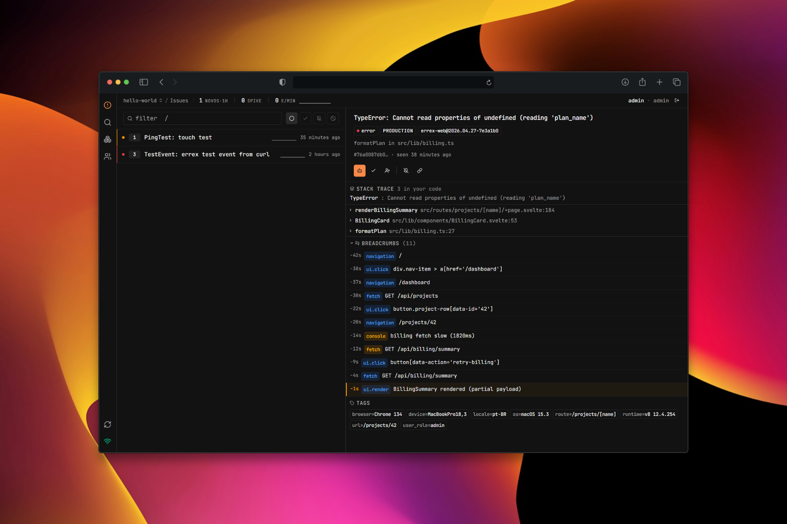

<div align="center">

# errex

**Self-hosted error tracking in 7 MB of RAM. One 5 MB binary. Zero deps. Sentry-SDK compatible.**

[](./LICENSE)
[](#status)
[](https://www.rust-lang.org/)
[](https://github.com/TheHoltz/errex/stargazers)

<br>



<sub><i>Live issue list. Counts and "last seen" timestamps update over WebSocket as events arrive — no polling.</i></sub>

</div>

## Run it

```bash
docker run -d --name errex \
  -p 9090:9090 \
  -v errex-data:/data \
  -e ERREX_ADMIN_TOKEN="$(openssl rand -hex 16)" \
  ghcr.io/theholtz/errex:latest
```

Open <http://localhost:9090/setup>, paste the admin token from the env, finish the wizard.

Multi-arch (amd64 + arm64). The full env / CLI reference is in [docs/CONFIGURATION.md](./docs/CONFIGURATION.md). To build from source: `git clone … && docker compose -f docker/docker-compose.yml up -d`.

## What it is

errex is a small self-hostable error tracker for people who want their own error inbox without standing up Sentry's Postgres + Redis + Kafka stack. Drop any Sentry SDK into your app, point it at errex, and you get grouped exceptions, stack traces, occurrence counts, regression detection, and Slack / Discord / Teams alerts.

The whole thing is one Rust binary with a SvelteKit dashboard embedded. Persistence is a single SQLite file (no Postgres, no Redis). The ingest pipeline is single-writer with bounded buffers — backpressure, not unbounded queues.

errex is also MCP-ready: an AI agent can plug straight into the daemon to triage issues, summarize stack traces, and resolve duplicates without touching the dashboard. (Stub today; the protocol surface is wired.)

If you're an indie dev, a homelabber, or running a small product, this is probably what you wanted Sentry to be — error monitoring that fits on the same $5 VPS as your app, with room to spare.

## Numbers

Headline: **idle 7 MB · saturation 10.5 MB · 7,500 events/s · 5 MB binary**.

| operating point              |  RPS | p99 (ms) | mean RSS (MB) | max RSS (MB) |
|------------------------------|-----:|---------:|--------------:|-------------:|
| idle (daemon + SPA warm)     |    — |        — |           6.9 |          7.0 |
| typical (100 RPS sustained)  |  100 |       <2 |           9.8 |         10.0 |
| saturation (8000 RPS target) | 7491 |      4.9 |          10.5 |         10.8 |

Single CPU, daemon `taskset -c 0`-pinned, 30 s sustained, fresh tempdir SQLite. Idle is post-warmup — every SPA asset (HTML + JS bundles + favicon) has been served at least once. Reproduce with `scripts/stress/multibench.sh`.

> [!IMPORTANT]
> **Survives memory-capped bursts.** Run inside a 96 MB cgroup (`MemoryMax=96M`, `CPUQuota=100%`), driven at 4k RPS sustained for 60 s, errex held the cap with **0 OOM kills, 0 ingest errors, 0 dashboard errors**. Cgroup memory peaked at 96 MB (incl. SQLite WAL page cache); the kernel reclaimed pages on demand under pressure. Reproduce with `scripts/stress/prod_test.sh`.

## What it costs to run

- Smallest tier on Railway / Fly / Render is 256 MB. errex uses 2.7% of that at idle.
- 100 RPS sustained leaves 96% of a 256 MB tier free for your other workloads.
- Spike to 8000 events/sec stays sub-11 MB daemon RSS. No tier upgrade.
- Frontend is included — no second container, no nginx in front of static files, no extra service.
- Dashboard updates live over WebSocket; events appear in the SPA in <100 ms after ingest.

## How it compares

| | min RAM | services | install |
|---|---:|---:|---|
| **errex**          |  ~7 MB |  1  | one binary |
| GlitchTip          | ~512 MB |  3  | docker-compose |
| Sentry self-host   |   ~4 GB | ~10 | full stack (Postgres + Redis + Kafka + Snuba + Clickhouse) |

> [!NOTE]
> errex is **alpha**. The hot path (ingest → group → store → broadcast) is wired and tested end-to-end. Source maps and multi-tenant orgs aren't shipped yet — see [Status](#status). Numbers above are single-host bench results; multi-day soak, 100+ simultaneous dashboard users, and login spikes (argon2 transient memory) have not been stress-validated. Plan headroom accordingly.

## Validated

**Tests.** 432 across daemon + SPA, all green. Pure-logic modules and store methods covered by colocated `*.test.ts` / `tests/*.rs`. Concurrency contract pinned by `tests/concurrency.rs` (16 readers + 1 writer, p99 < 100 ms). SPA mime coverage pinned by `tests/spa.rs` — CI fails if a future SvelteKit build emits a file extension without an explicit content-type mapping.

**Stress.** `scripts/stress/multibench.sh` measures idle, low load (100 RPS), and saturation (8000 RPS) in one run and emits a single JSON report. `scripts/stress/prod_test.sh` boots the daemon inside a transient `systemd-run --user --scope` cgroup with `MemoryMax=` and `CPUQuota=` enforced, then drives ingest + dashboard reader agents + WS subscribers concurrently — the cgroup-cap claim above came from this.

**Real browser.** Chrome DevTools MCP test loads the SPA, runs the real login flow with cookies, opens multiple tabs, and verifies that 1,477 events ingested via curl appear live in the issue list with 0 console errors and 0 4xx/5xx responses.

## How it works

SDK posts a Sentry envelope to `/api/<project>/envelope/`. The HTTP handler parses, fingerprints, and hands the event to a single-writer digest task that upserts the issue and persists the event into SQLite (WAL mode). The same digest task fans the change out over `tokio::sync::broadcast` to any connected dashboard tab via WebSocket, and dispatches a webhook to Slack / Discord / Teams when the issue is new or has regressed. Readers hit SQLite directly via WAL — no in-memory caches, bounded channels with intentional backpressure. See [docs/ARCHITECTURE.md](./docs/ARCHITECTURE.md) for the rationale behind each choice.

## Status

| | |
|---|---|
| ✅ | Sentry envelope ingest (gzip + plaintext) |
| ✅ | SQLite persistence with WAL |
| ✅ | Fingerprint-based grouping |
| ✅ | Live WebSocket updates |
| ✅ | Resolve / mute / ignore / regression detection |
| ✅ | DSN auth, retention, per-project rate limits |
| ✅ | Slack / Discord / Teams webhooks |
| 🟡 | MCP server (stub — for AI triage agents) |
| ❌ | Source maps / symbolication |
| ❌ | Multi-tenant orgs |

## Contributing

PRs welcome. Read [CONTRIBUTING.md](./CONTRIBUTING.md) and [CLAUDE.md](./CLAUDE.md) first — Rust changes require failing-test-first TDD, and `./errex.sh check` must be green.

## License

[AGPL-3.0](./LICENSE). Run errex however you want, for whatever reason. If you fork it and run the modified version as a network service, you must publish your changes. That's the whole deal.
